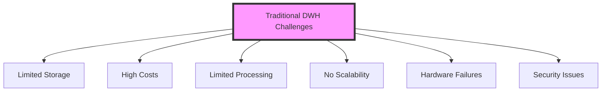
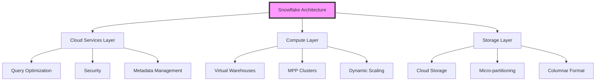
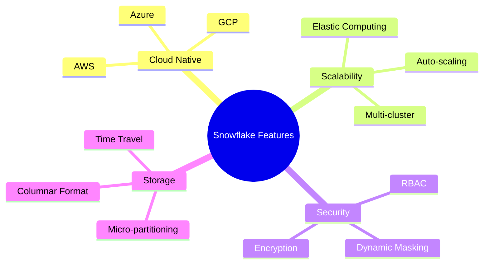
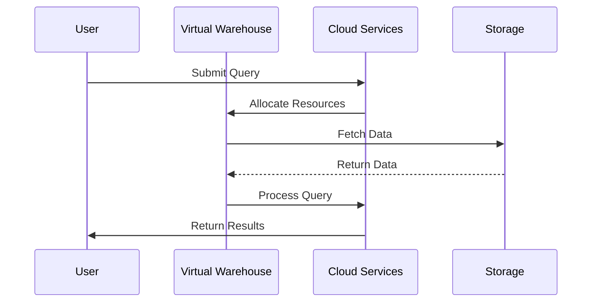
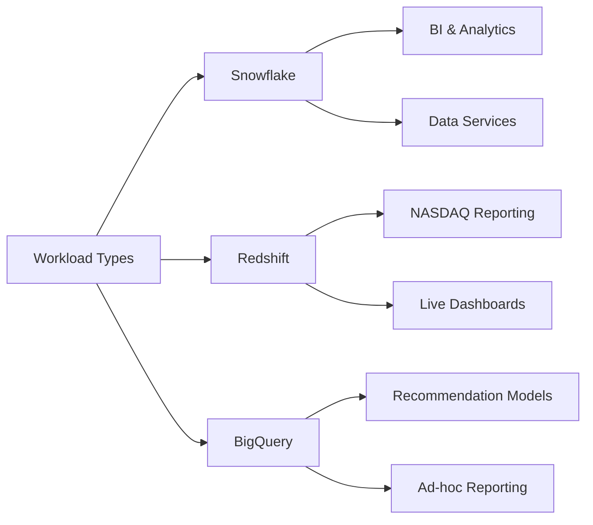
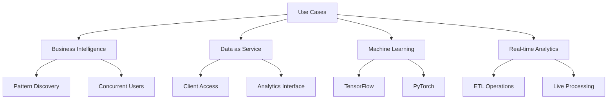
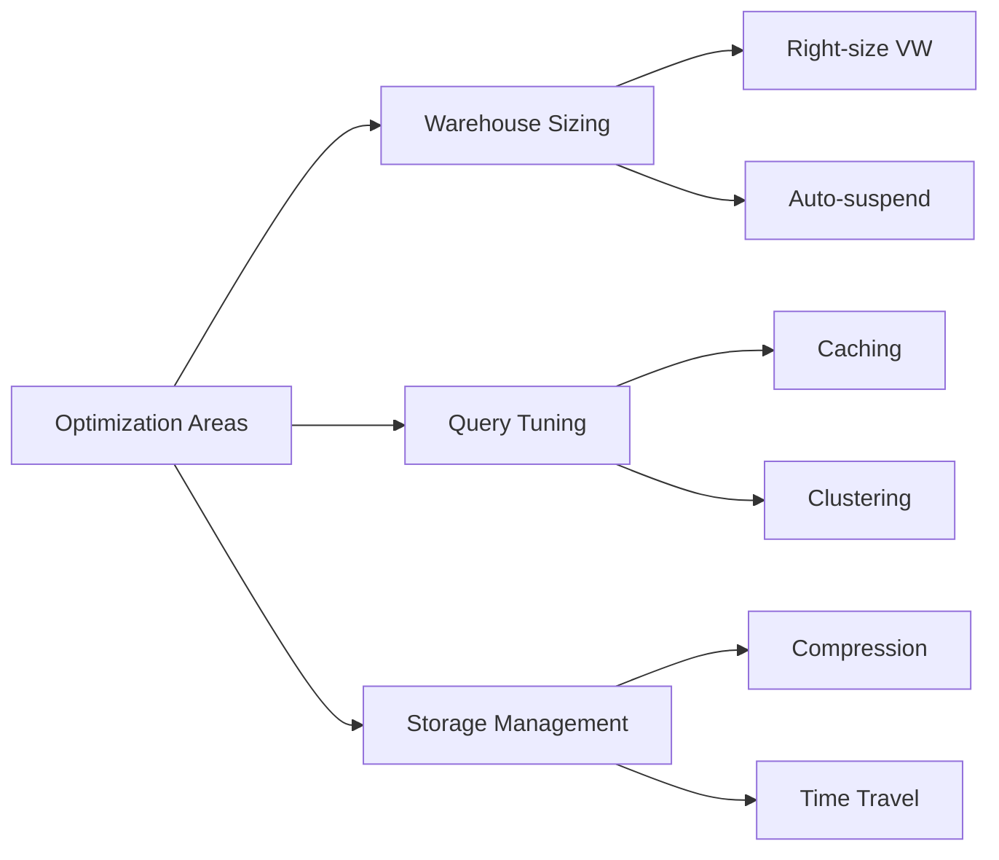

# Snowflake Technical Documentation
[Company Logo]

## Document Information
- **Title**: Snowflake Technical Documentation
- **Date**: June 25, 2025
- **Version**: 1.0

## Table of Contents
1. Introduction
2. Traditional DWH Challenges
3. Snowflake Overview
4. Architecture
5. Key Features
6. Technical Components
7. Cloud Providers & Availability
8. Security & Access Control
9. Competitive Analysis
10. Use Cases & Implementation
11. Best Practices
12. Advanced Features

## 1. Introduction
Developed in 2012, Snowflake is a fully managed SaaS (Software as a Service) platform that provides a single solution for:
- Data warehousing
- Data lakes
- Data engineering
- Data science
- Data application development
- Secure sharing and consumption of real-time or shared data

## 2. Traditional DWH Challenges
### Infrastructure Limitations
- IAAS: DWH was primarily focused on Infrastructure-as-a-Service (IAAS)
- Limited Storage Capacity: Despite having storage arrays, archival is required after specific periods
- High Cost: Storage disk expansion leads to increased costs
- Limited Processing Capability: Extended processing times due to Single Core machines or limited infrastructure
- No Scalability: Conventional databases cannot handle enormous data growth
- Hardware Issues: Aging hardware and frequent hardware failures
- Security Concerns: Multiple data sources create potential security vulnerabilities

## 3. Snowflake Overview
### True SaaS Platform
- No hardware (virtual or physical) to select, install, configure, or manage
- Virtually no software to install, configure, or manage
- Ongoing maintenance, management, upgrades, and tuning handled by Snowflake

### Cloud Infrastructure
- Operates entirely on public cloud environments
- Uses cloud-native architecture
- Virtual compute instances for processing
- Storage service for persistent data storage
- Cannot run on private cloud infrastructures (on-premises or hosted)

## 4. Architecture
### Three-Layer Architecture
1. **Cloud Services Layer**
   - Infrastructure management
   - Metadata management
   - Query parsing and optimization
   - Security management

2. **Compute Layer**
   - Virtual warehouses (MPP compute clusters)
   - Query execution
   - Dynamic scaling
   - Multi-cluster capabilities
   - Standard and Snowpark-optimized warehouses

3. **Storage Layer**
   - Persistent storage using cloud blob storage
   - Supports AWS, Azure, and GCP
   - Micro-partitioned data organization
   - Compressed columnar format

## 5. Key Features
### Core Capabilities
- Elastic Scalability
- High Availability & Security
- Fast Data Retrieval
- Flexible Pricing (Pay-as-you-go)
- Zero Management/Maintenance
- Cloud-Native Advantages
- Seamless Collaboration & Data Sharing
- Near Zero Downtime
- Time Travel & Fail-Safe

### Advanced Features
- Native support for semi-structured data (JSON, Parquet, Avro, ORC, XML)
- Time Travel (90-day historical data access)
- Fail-Safe data recovery
- Automatic clustering
- Serverless capabilities
- Global data replication

## 6. Technical Components
### Storage Optimization
- Columnar database structure
- 16 MB large block size
- Automatic statistics management
- Built-in compression

### Compute Resources
- Instant auto-suspend
- Auto-resume functionality
- Dynamic cluster scaling
- Concurrency control
- Resource optimization

## 7. Cloud Providers & Availability
### Supported Platforms
- Amazon Web Services (AWS)
- Google Cloud Platform (GCP)
- Microsoft Azure

### Regional Coverage
- North & South America
- Europe & Middle East
- Asia-Pacific

## 8. Security & Access Control
### Security Features
- Role-Based Access Control (RBAC)
- Row Masking Policies
- Dynamic Data Masking
- Network Policies
- Enterprise-grade encryption

### Access Management
- Snowpark integration
- Notebook support
- Streamlit compatibility
- External network controls

## 9. Competitive Analysis
### Comparison with Major Competitors
1. **Amazon Redshift**
   - Best for constant computation
   - Use cases: NASDAQ daily reporting, automated ad-bidding
   - Requires system engineering expertise

2. **Google BigQuery**
   - Optimal for spiky workloads
   - Use cases: recommendation models, ad-hoc reporting
   - Pay-per-query pricing model

3. **Snowflake Advantages**
   - Best for steady, continuous usage
   - Dynamic scaling capabilities
   - Cost-effective for consistent workloads

## 10. Use Cases & Implementation
### Primary Applications
- Business Intelligence (BI)
- Data as a Service
- Machine Learning/AI Integration
- Real-time Analytics
- ETL Operations
- Data Science Workflows

## 11. Best Practices
### Performance Optimization
- Warehouse sizing strategies
- Concurrency management
- Query optimization techniques
- Storage management
- Cost optimization

## 12. Advanced Features
### Cortex AI Capabilities
- Copilot functionality
- RAG implementation
- Search Service
- LLM Functions
- Document AI
- Result Cache

### Data Science & ML
- Integration with PyTorch
- TensorFlow support
- Hugging Face compatibility
- Large-scale ETL operations
- ML model building capabilities

[Include all relevant diagrams from the markdown version]

## Appendix
### Additional Resources
- Official Documentation
- Best Practices Guide
- Architecture Deep Dive
- Implementation Guidelines

### Contact Information
[Include relevant contact details]

### Document Revision History
Version 1.0 - Initial Release (June 25, 2025)

Snowflake is a fully managed SaaS (Software as a Service) platform developed in 2012 that provides comprehensive solutions for:
- Data warehousing
- Data lakes
- Data engineering
- Data science
- Data application development
- Secure data sharing

### Traditional DWH Challenges

## Architecture Overview

### Three-Layer Architecture

## Key Features

### Core Capabilities

## Technical Components

### Data Processing Flow

## Comparison with Competitors

| Feature | Snowflake | Amazon Redshift | Google BigQuery |
|---------|-----------|-----------------|-----------------|
| Best Use Case | Steady, continuous usage | Constant computation | Spiky workloads |
| Scaling | Automatic | Manual | Serverless |
| Pricing | Pay-as-you-go | Reserved nodes | Query-based |
| Management | Fully managed | Some management required | Fully managed |

### Workload Comparison

## Use Cases

### Common Implementation Scenarios

## Best Practices

### Performance Optimization

> **Note**: This documentation uses Mermaid.js for diagrams. Ensure your markdown viewer supports Mermaid diagram rendering.
