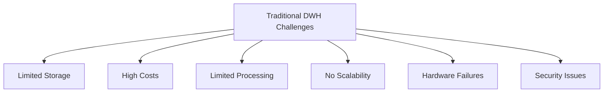
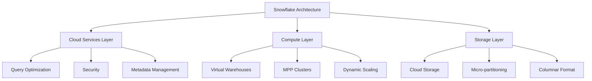
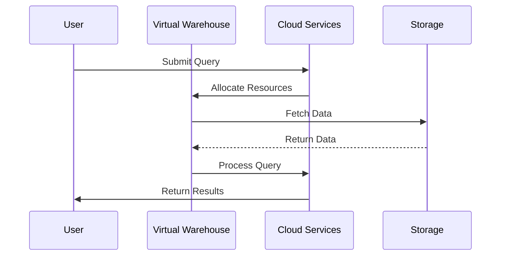
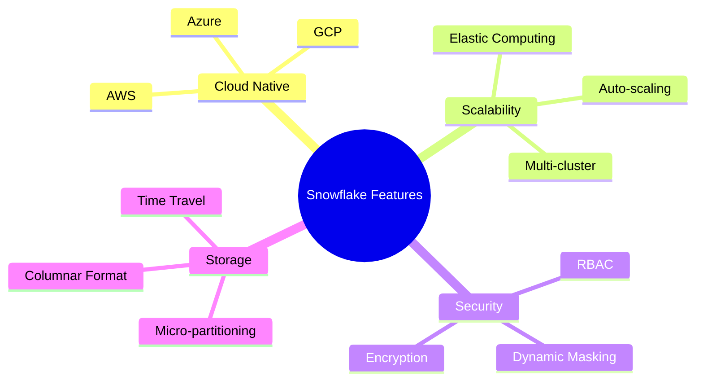
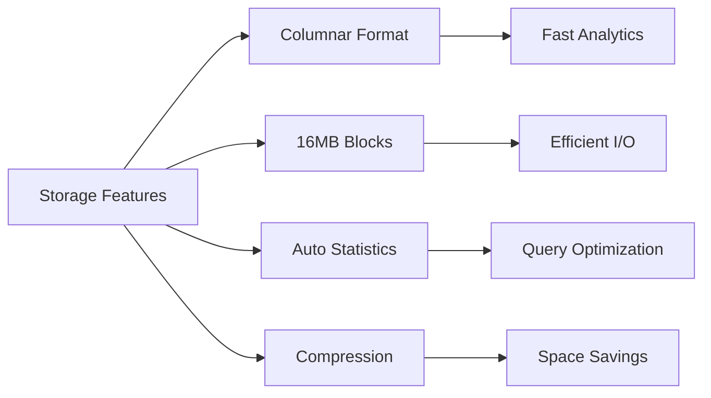
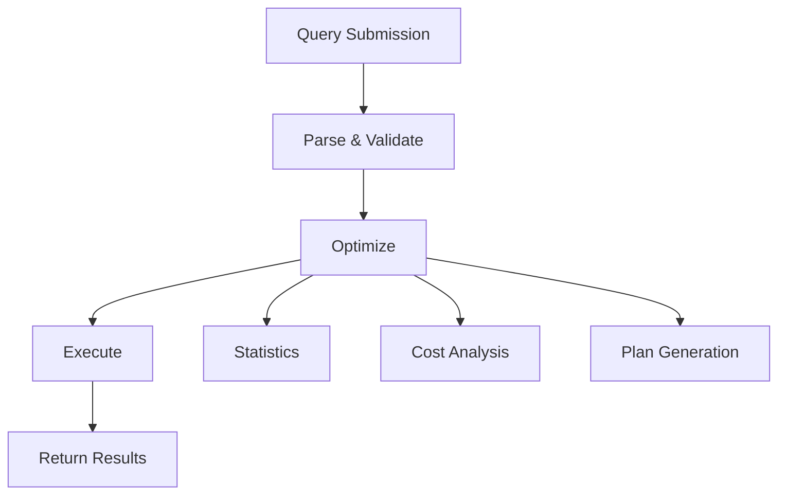
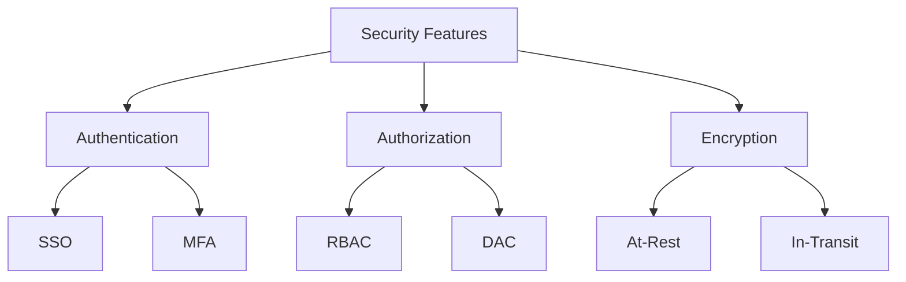
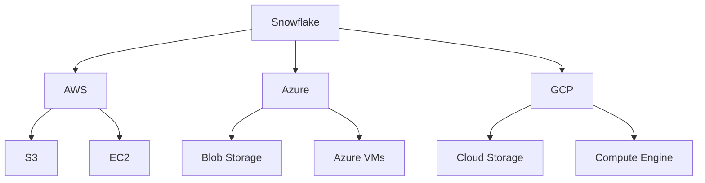
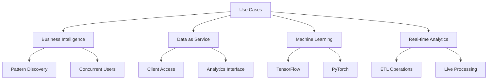
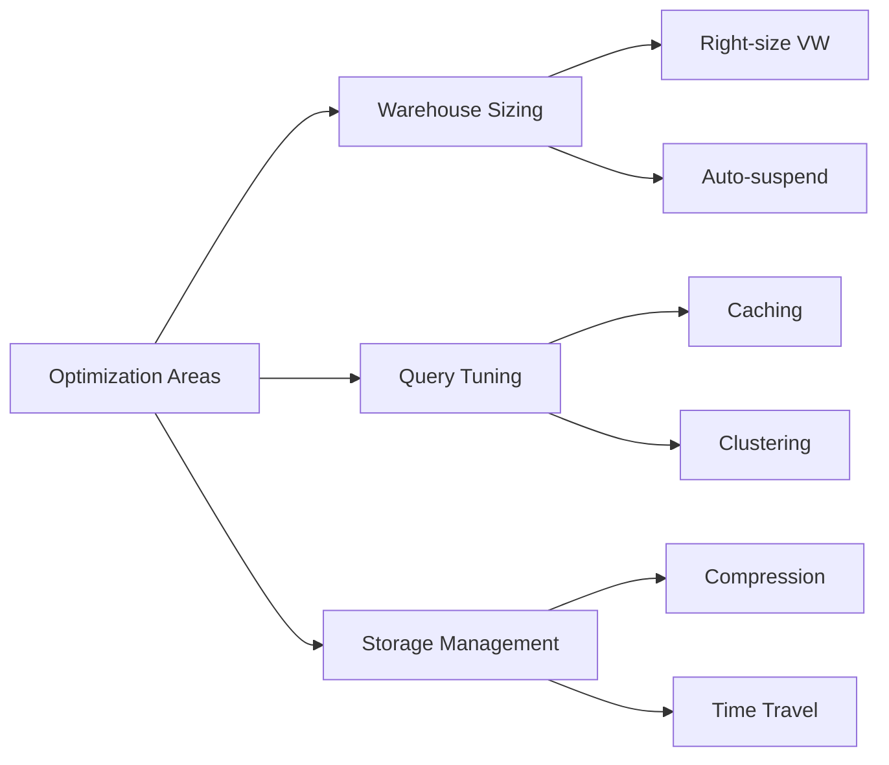

# Snowflake Technical Documentation
**Version**: 1.0  
**Last Updated**: June 25, 2025  
**Status**: Production  

## Table of Contents
1. [Introduction](#introduction)
2. [Architecture Overview](#architecture-overview)
3. [Key Features](#key-features)
4. [Technical Components](#technical-components)
5. [Security & Compliance](#security--compliance)
6. [Cloud Integration](#cloud-integration)
7. [Use Cases](#use-cases)
8. [Best Practices](#best-practices)
9. [Comparison with Competitors](#comparison-with-competitors)
10. [Advanced Features](#advanced-features)

## Introduction

### Overview
Developed in 2012, Snowflake is a fully managed SaaS (Software as a Service) platform providing comprehensive solutions for:
- Data warehousing
- Data lakes
- Data engineering
- Data science
- Data application development
- Secure data sharing

### Traditional DWH Challenges

## Architecture Overview

### Three-Layer Architecture

### Data Processing Flow

## Key Features

### Core Capabilities

### Technical Specifications
1. **Cloud Services Layer**
   - Infrastructure management
   - Metadata management
   - Query parsing and optimization
   - Security management

2. **Compute Layer**
   - Virtual warehouses (MPP compute clusters)
   - Query execution
   - Dynamic scaling
   - Multi-cluster capabilities
   - Standard and Snowpark-optimized warehouses

3. **Storage Layer**
   - Persistent storage using cloud blob storage
   - Supports AWS, Azure, and GCP
   - Micro-partitioned data organization
   - Compressed columnar format

## Technical Components

### Storage Optimization

### Query Processing

## Security & Compliance

### Security Architecture

## Cloud Integration

### Provider Integration

## Use Cases

### Implementation Scenarios

## Best Practices

### Performance Optimization

## Comparison with Competitors

| Feature | Snowflake | Amazon Redshift | Google BigQuery |
|---------|-----------|-----------------|-----------------|
| Architecture | Cloud-native SaaS | Managed service | Serverless |
| Scaling | Automatic | Manual | Automatic |
| Pricing | Per-second | Instance-based | Query-based |
| Best For | Steady workloads | Constant compute | Spiky workloads |
| Management | Fully managed | Some management | Fully managed |

## Advanced Features

### Cortex AI Capabilities
- Copilot functionality
- RAG implementation
- Search Service
- LLM Functions
- Document AI
- Result Cache

### Data Science & ML
- Integration with PyTorch
- TensorFlow support
- Hugging Face compatibility
- Large-scale ETL operations
- ML model building capabilities

## Additional Resources
- [Official Documentation](https://docs.snowflake.com/)
- [Best Practices Guide](https://docs.snowflake.com/en/user-guide/admin-best-practices)
- [Architecture Deep Dive](https://docs.snowflake.com/en/user-guide/intro-key-concepts)

---
