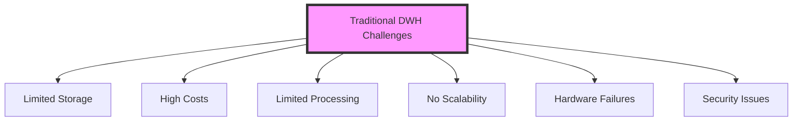
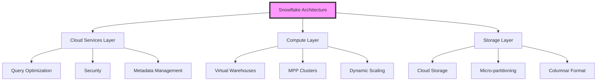
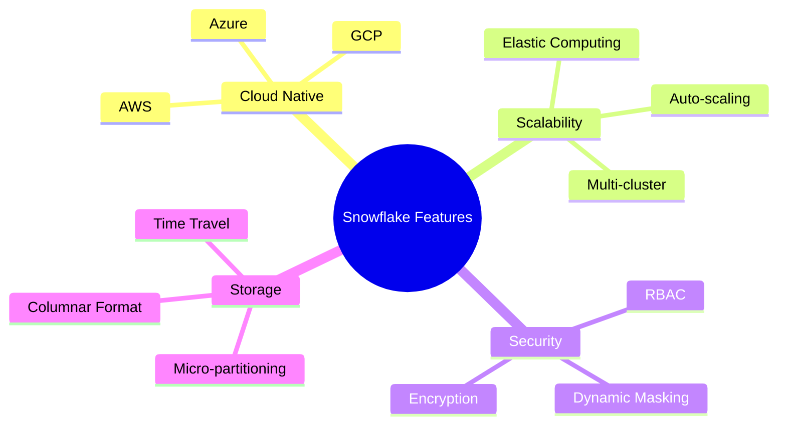
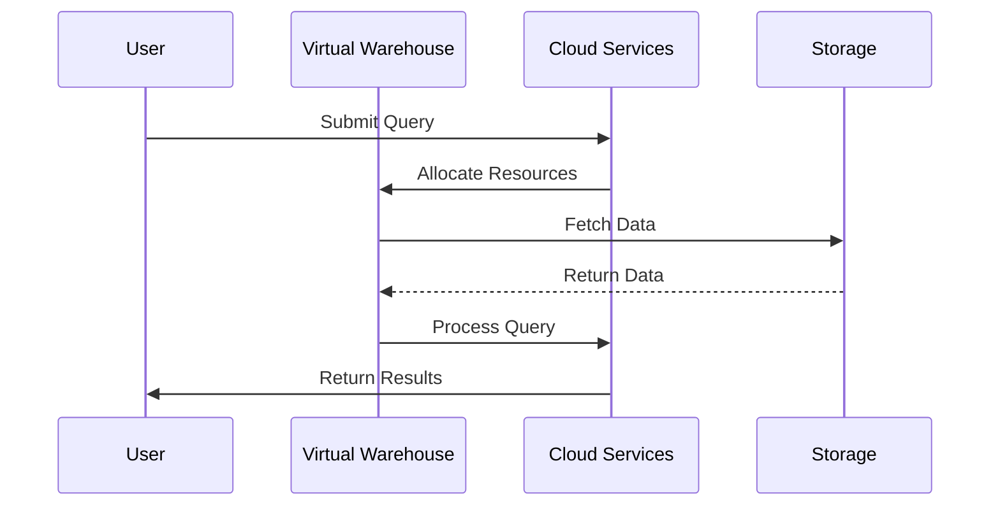
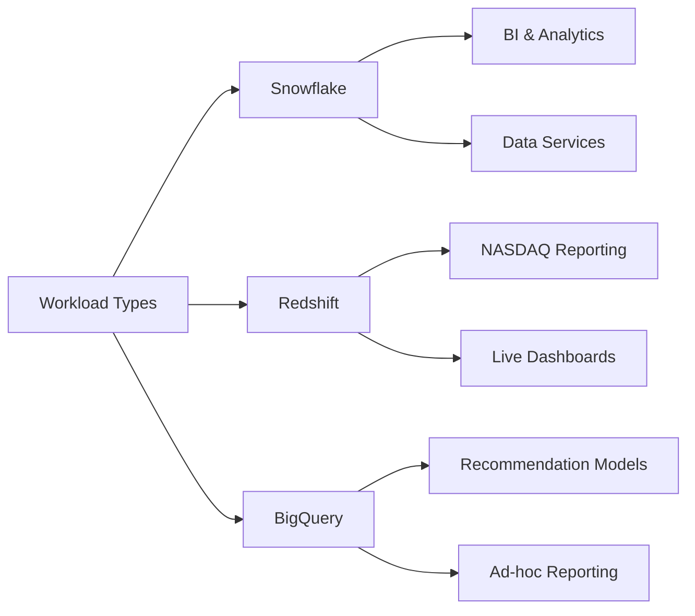
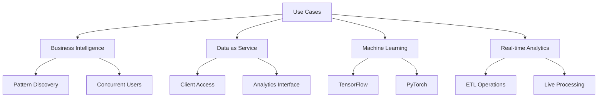
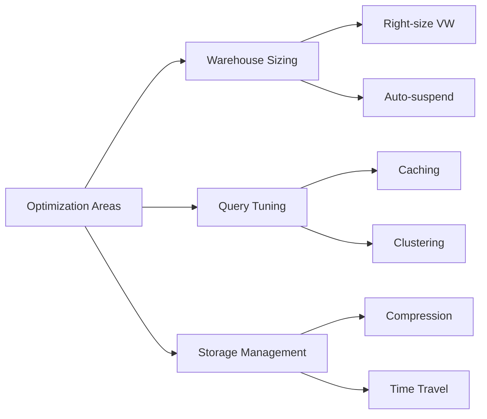

# Snowflake Technical Documentation

## Table of Contents
1. [Introduction](#introduction)
2. [Architecture Overview](#architecture-overview)
3. [Key Features](#key-features)
4. [Technical Components](#technical-components)
5. [Comparison with Competitors](#comparison-with-competitors)
6. [Use Cases](#use-cases)
7. [Best Practices](#best-practices)

## Introduction

Snowflake is a fully managed SaaS (Software as a Service) platform developed in 2012 that provides comprehensive solutions for:
- Data warehousing
- Data lakes
- Data engineering
- Data science
- Data application development
- Secure data sharing

### Traditional DWH Challenges

## Architecture Overview

### Three-Layer Architecture

## Key Features

### Core Capabilities

## Technical Components

### Data Processing Flow

## Comparison with Competitors

| Feature | Snowflake | Amazon Redshift | Google BigQuery |
|---------|-----------|-----------------|-----------------|
| Best Use Case | Steady, continuous usage | Constant computation | Spiky workloads |
| Scaling | Automatic | Manual | Serverless |
| Pricing | Pay-as-you-go | Reserved nodes | Query-based |
| Management | Fully managed | Some management required | Fully managed |

### Workload Comparison

## Use Cases

### Common Implementation Scenarios

## Best Practices

### Performance Optimization

> **Note**: This documentation uses Mermaid.js for diagrams. Ensure your markdown viewer supports Mermaid diagram rendering.
